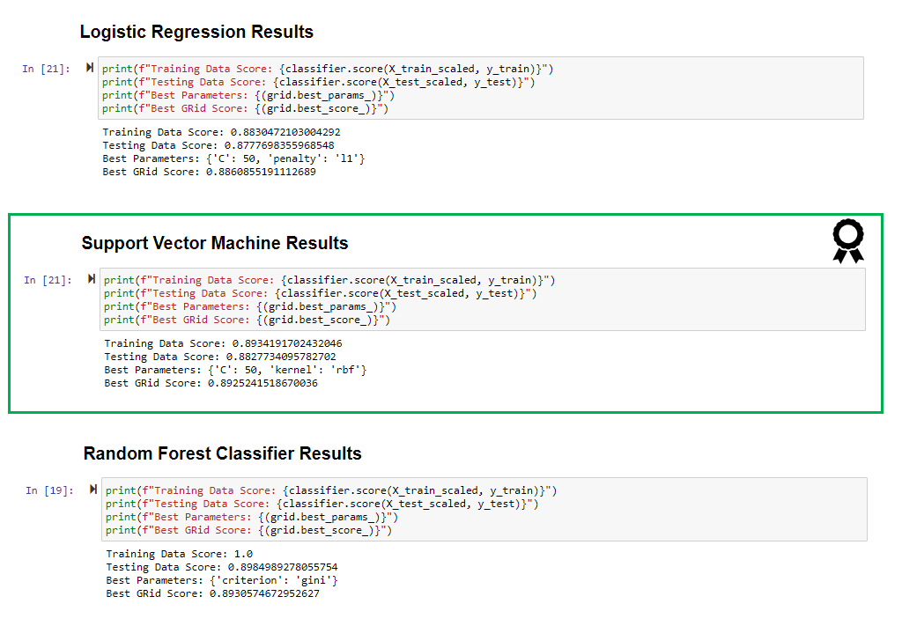

# Comparison Model Report - Exoplanet Exploration

## Models

The following machine learning models have been used to classify the candidate exoplanets from a raw dataset.

* Logistic Regression
* Support Vector Machine
* Random Forest Classifier

For each model I have completed the following:

1. Preprocess the raw data
2. Tuned the models
3. Compared results against each model

- - -

## Findings

Comparing the model results I noted the following;

* The Logistc Regression model accuracey on the test data was 89.7% with the best grid score of 88.6%
* The Support Vector Machine model accuracey on the test data was 88.2% with the best grid score of 89.2%
* The Random Forest Classifier model accuracey on the test data was 89.8% with the best grid score of 89.3%
* Comparing the Training data scores the Random Forest Classifier model scored 100% followed by the Support Vector Machine model which scored 89.3%

## Conslusion

In colclusion the Support Vector Machine model has a good all round and even result and would be a reliable model to predict new exoplanets even though the Random Forest Classifier model scored the highest Training, Test and Grid scores. 

To improve the model I would attempt apply deep learning model techniques and collect more data, trial different parameters and include additional variables with the aim to improve the model output results.

- - -

## Contributor
- [Alysha Snowden](https://github.com/alysnow)
